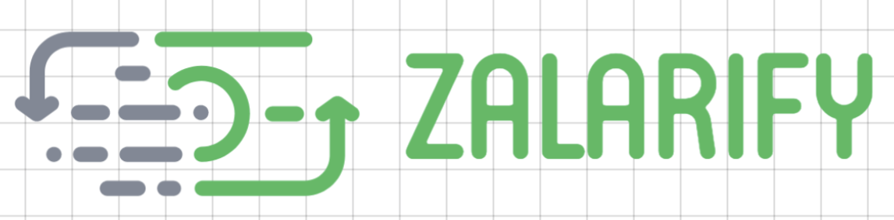
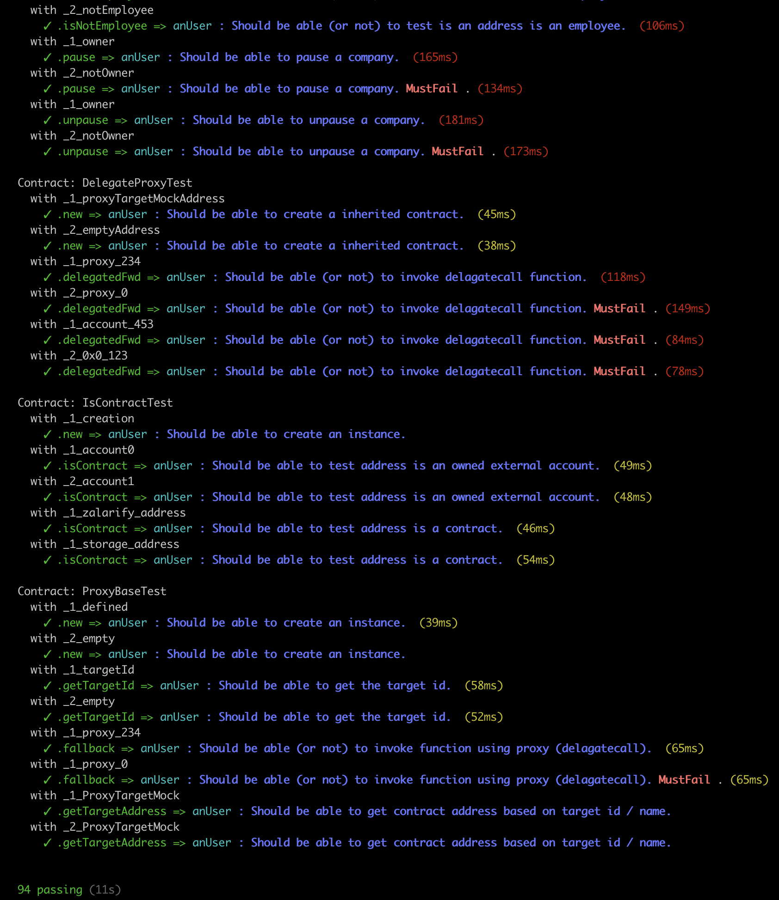
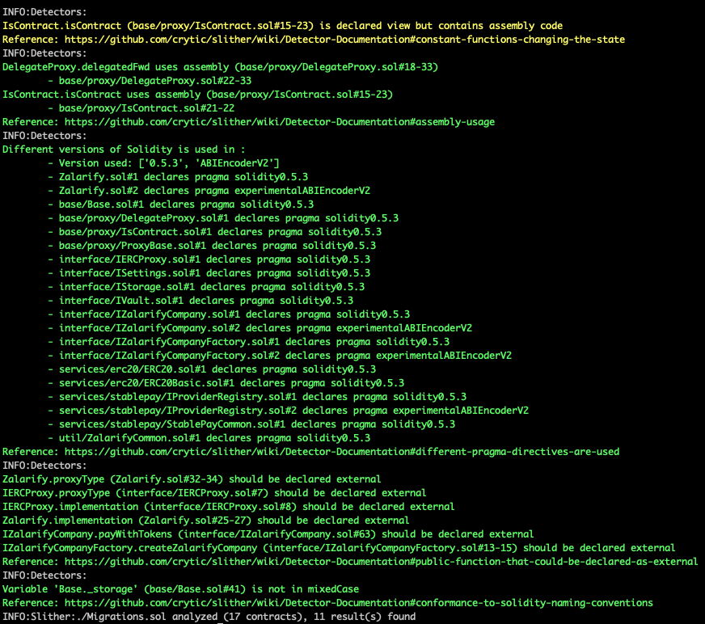

# Welcome to Zalarify

This is the official [Zalarify](http://zalarify.io) repository for the:

- Smart contracts.
- API Rest.
- Web application.

## What is Zalarify?

[Zalarify](http://zalarify.io) is a decentralized platform for transfering payrolls to your employees. The company owners can pay using any ERC20 tokens, and their employees get the stablecoin DAI (*it'll include new stablecoins in some months*).

## What can you do with Zalarify?

Using [Zalarify](http://zalarify.io) you can:

- Create your own company.
- Add new employees to your company.
- Transfer the payroll to your employees using any ERC20, and the employees receive the ERC20 token they prefer. This functionality is integrated with [StablePay](http://stablepay.io) smart contracts.
- Generate a payment receipt in IPFS.

---

## Get Started

### Checkout the repository

```sh
$ git checkout https://github.com/salazarguille/Zalarify.git
```

### Requirements

Install Truffle
```sh
$ npm install truffle -g
```

Install Ganache Cli

```sh
$ npm install ganache-cli -g
```

### Install Dependencies

Once you have installed Truffle and Ganache CLI, you need to install the project dependencies. Located at the root project folder, run the command

```sh
$ npm install
```

### Setup Environment Variables

The platform needs some env variables to be configured properly. In order to configure them, create a `.env` file based on the `.env.template` file.

Once the file was created, it needs to setup some values. Please, follow the instruction to setup these values before executing any command.

#### Infura

The **INFURA_KEY** key is needed to execute smart contracts in a testnet or mainnet. To get a key, just visit [Infura.net](https://infura.net), and signup.

#### Mnemonic

 The **MNEMONIC_KEY** key is used to get/create the ethereum addresses.

#### Etherscan API Key (optional)

The **ETHERSCAN_API_KEY** key was used to verify the smart contracts in [Ropsten Etherscan](https://ropsten.etherscan).

### Start Zalarify

#### Using Ganache

The platform uses the [StablePay](http://stablepay.io) smart contracts which also uses the [Kyber Network](https://kyber.network) and [Uniswap](https://uniswap.io/k) smart contracts. So, Zalarify needs a Ganache snapshot with the full smart contracts. It is included in the project. So, to start Zalarify using Ganache, please follow the below steps:

1. Uncompress the file ```resources/db.zip``` into ```./db``` folder (at the root level).
2. Verify there is not any sub-folder in ```./db``` (just a lot of files).
3. Execute in the root folder.

```sh
$ npm run start:all
```

Once the application starts, it will open a tab browser.

> **IMPORTANT NOTE:** Remember start your Metamask extension using the mnemonic in the ganache snapshot. It is "`gesture rather obey video awake genuine patient base soon parrot upset lounge`".

### Run tests

After configuring the environment variables, the tests can be executed.

#### Unit Tests

```sh
$ truffle test
```




## Security

Smart contracts were validated by [Slither](https://github.com/crytic/slither/blob/master/README.md). If you want to verify them, follow the following steps:

* Pull the Docker Image executing ```docker pull trailofbits/eth-security-toolbox```.

* Start the docker container executing ```docker run -it -v /local/path/to/contracts/folder:/share trailofbits/eth-security-toolbox```.

* Once you are in the container, execute: ```slither .```.

If you need to change the solc version, use ```solc-select``` cli.

```bash
$ solc --version
solc, the solidity compiler commandline interface
Version: 0.5.2+commit.1df8f40c.Linux.g++

$ solc-select 0.4.24
$ solc --version
solc, the solidity compiler commandline interface
Version: 0.4.24+commit.e67f0147.Linux.g++
```

### Verification Results



All the high severity issues were fixed during the development. Now the smart contracts contain only low priority issues.

## Contact Me

If you have any question or feedback, contact me at guillesalazar@gmail.com.
