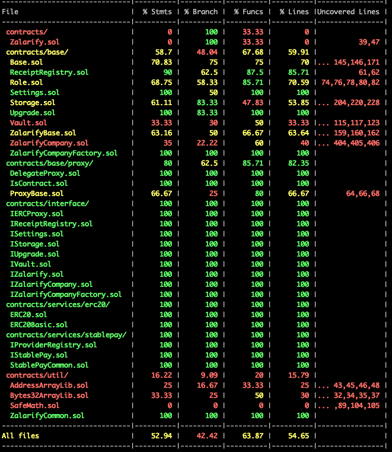
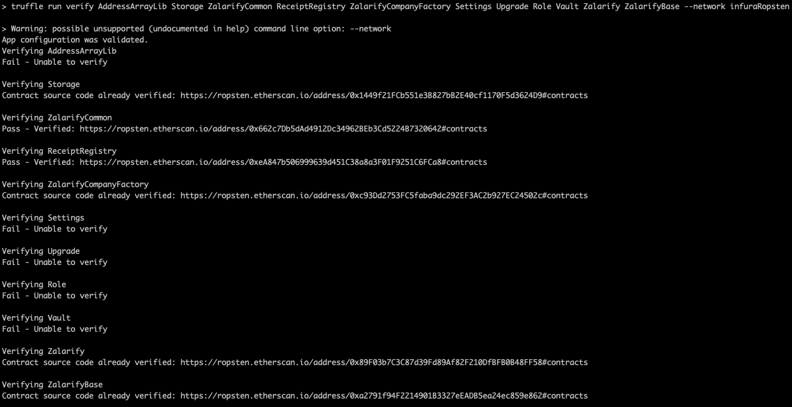

# Welcome to Zalarify

[](https://circleci.com/gh/salazarguille/Zalarify/tree/master)

[](https://coveralls.io/github/salazarguille/Zalarify?branch=master)

This is the official [Zalarify](http://zalarify.io) repository for the:

- Smart contracts.
- API Rest.
- Web application.

## What is Zalarify?

[Zalarify](http://zalarify.io) is a decentralized platform for transfering payrolls to your employees. The company owners can pay using any ERC20 tokens, and their employees get the stablecoin DAI (*it'll include new stablecoins in some months*).

## What can you do with Zalarify?

Using [Zalarify](http://zalarify.io) you can:

- Create your own company.
- Add new employees to your company.
- Transfer the payroll to your employees using any ERC20, and the employees receive the ERC20 token they prefer. This functionality is integrated with [StablePay](http://stablepay.io) smart contracts.
- Generate a payment receipt in IPFS.

---

## Get Started

### Checkout the repository

```sh
$ git checkout https://github.com/salazarguille/Zalarify.git
```

### Requirements

Install Truffle
```sh
$ npm install truffle -g
```

Install Ganache Cli

```sh
$ npm install ganache-cli -g
```

---

### Configure Modules

Once you have installed Truffle and Ganache CLI, you need to configure each module.

#### Truffle Module

##### Setup Environment Variables

*The Truffle module is located in the root folder.*
The Truffle module needs some env variables to be configured properly. In order to configure them, create a `.env` file based on the `.env.template` file (copy `.env.template` file to `.env`).

Once the file was created, it needs to setup some values. Please, follow the instruction to setup these values before executing any command.

###### Infura (required)

The **INFURA_KEY** key is needed to execute smart contracts in a testnet or mainnet. To get a key, just visit [Infura.net](https://infura.net), and signup.

###### Mnemonic (required)

 The **MNEMONIC_KEY** key is used to get/create the ethereum addresses.

###### Etherscan API Key (optional)

The **ETHERSCAN_API_KEY** key was used to verify the smart contracts in [Ropsten Etherscan](https://ropsten.etherscan).

##### Install Dependencies

In ```root``` folder, execute:

```sh
$ npm install
```

---

#### Rest API Module

The API module needs some env variables to be configured properly. In order to configure them, create a `.env` file based on the `.env.template` file located at `api-rest` folder (copy `api-rest/.env.template` file to `api-rest/.env`).

##### Setup Environment Variables

The values in the `api-rest/.env.template` file are valid to run the application using Ganache. So, you don't need to modify it.

> In case you need to run the application pointing to Ropsten, just modify the variable value DEFAULT_ETHEREUM_NETWORK to `ropsten`.

##### Install Dependencies

In the ```./api-rest``` folder, execute:

```sh
$ npm install
```

---

#### UI Module

This module is located at `client` folder. In order to configure them, create a `.env` file based on the `.env.local.template` file located at `client` folder (copy `client/.env.local.template` file to `client/.env`).

##### Setup Environment Variables

The values in the `.env.local.template` file are valid to run the application using Ganache. So, you don't need to modify it.

> In case you need to run the application pointing to Ropsten, just modify the variable value REACT_APP_DEFAULT_NETWORK to ropsten.

##### Install Dependencies

In the ```./client``` folder, execute:

```sh
$ npm install
```


#### The Graph Module (not required)

This module is not required to configure because it is only for testnets, and it is already configured and deployed in Ropsten.

You can access to it using this [link](https://thegraph.com/explorer/subgraph/salazarguille/zalarify).

### Start Zalarify Locally

Once you have configured all the required module, you are able to start the application using Ganache.

#### Using Ganache

The platform uses the [StablePay](http://stablepay.io) smart contracts which also uses the [Kyber Network](https://kyber.network) and [Uniswap](https://uniswap.io/k) smart contracts. So, Zalarify needs a Ganache snapshot with the full smart contracts which is included in the project. So, to start Zalarify using Ganache, please follow the below steps:

1. Uncompress the file ```resources/db.zip``` into ```./db``` folder (at the root project folder).
2. Verify there is not any sub-folder in ```./db``` (just files).
3. Execute in the root folder.

```sh
$ npm run start:all
```

Once the application starts, it will open a tab browser.

> **IMPORTANT NOTE:** Remember start your Metamask extension using the mnemonic in the ganache snapshot. It is "`gesture rather obey video awake genuine patient base soon parrot upset lounge`".

### Run tests

After configuring the environment variables, the tests can be executed.

#### Unit Tests

```sh
$ truffle test
```


#### Code Coverage (solidity-coverage)

The platform uses the [solidity-coverage](https://github.com/sc-forks/solidity-coverage) dependency. It can be executed with the command below:

```npm run test:coverage```

As result, you will get:



##### Code Coverage Status

- Statements: 52.94 %
- Branches: 42.42 %
- Functions: 63.87 %
- Lines: 54.65 %

## Security

Smart contracts were validated by [Slither](https://github.com/crytic/slither/blob/master/README.md). If you want to verify them, follow the following steps:

* Pull the Docker Image executing ```docker pull trailofbits/eth-security-toolbox```.

* Start the docker container executing ```docker run -it -v /local/path/to/contracts/folder:/share trailofbits/eth-security-toolbox```.

* Once you are in the container, execute: ```slither .```.

If you need to change the solc version, use ```solc-select``` cli.

```bash
$ solc --version
solc, the solidity compiler commandline interface
Version: 0.5.2+commit.1df8f40c.Linux.g++

$ solc-select 0.4.24
$ solc --version
solc, the solidity compiler commandline interface
Version: 0.4.24+commit.e67f0147.Linux.g++

```

### Verification Results


All the high severity issues were fixed during the development. Now the smart contracts contain only low priority issues.

## Smart Contract Verification on Etherscan

I have used the Truffle plugin [truffle-verify-plugin](https://github.com/rkalis/truffle-plugin-verify) to verify the smart contracts.
The result is:



The file ```deployed_addresses.md``` contains which ones were verified.

## Contact Me

If you have any question or feedback, contact me at guillesalazar@gmail.com.
