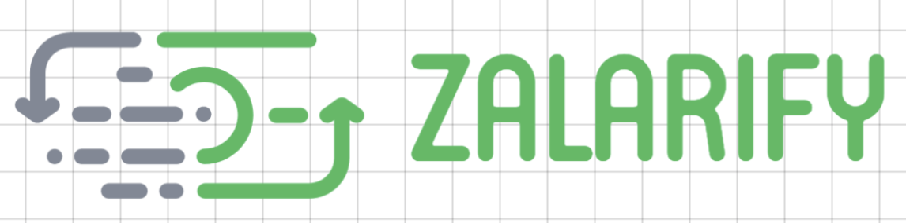

# Design Pattern Decisions
---

In the process of designing the smart contract, I tried to prioritize:

1. Security.
2. Upgradeability / extensible.
3. Configurable.
4. Multiple platform owners.

Based on those items, the taken decisions were oriented to:

- Minimize the security risks, adding a mechanimics to stop the platform. So any user, or company owner can take advantage if issues or bugs are found.
- Allow to update any smart contracts in the platform to fix issues/bugs or add new features/functionalities.
- Configure the platform as needs.
- To have administrative roles to update the platform configuration.

In order to support those feautes (apart from the business logic of Zalarify), Zalarify uses/implements:

- A delegate call (Proxy) to invoke the smart contract that contains the main business logic.
  - See more details about delegate call:
    - [Delegate Call Explained](https://medium.com/coinmonks/ethernaut-lvl-6-walkthrough-how-to-abuse-the-delicate-delegatecall-466b26c429e4).
    - [Delegate Call and Libraries](https://solidity.readthedocs.io/en/latest/contracts.html#libraries).
- An Eternal Storage pattern which contains all the configuration the platform needs. It makes the platform flexible, configurable, and accessible from any smart contract in Zalarify.
  - See more details about the Eternal Storage pattern:
    - [Pattern Explained](https://fravoll.github.io/solidity-patterns/eternal_storage.html).
    - [Storing Complex Data Types in Eternal Storage](https://ethereum.stackexchange.com/questions/52386/storing-complex-data-types-in-eternal-storage).
    - [Upgradable Solidity Contrart Design](https://medium.com/rocket-pool/upgradable-solidity-contract-design-54789205276d).
    - [Upgradeable Contracts: Eternal Storage Example](https://medium.com/@fuguefoundation/upgradeable-contracts-eternal-storage-example-using-zeppelinos-and-truffle-b680a86620cf).
- The platform has a design in which any smart contract can be easily updated, in case we or any user found a bug or issue.
- Internally the platform validates that only authorized contracts can invoke the platform smart contracts.
- A Vault smart contract in case users send Ether / Tokens to the platform. The Base smart contract implements a fallback function which transfer the Ether or Token to the Vault. Then, the Vault allows to transfer/withdraw the Ether/Token to a specific address. It functionality can be accessed by a platform owner or admin.

# Contact

If you have any comment, feedback, or question, just contact me at ```guillesalazar@gmail.com```.
